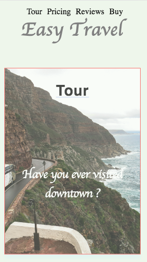

<!-- project's name -->
# landing-page 

<!-- introduction -->
#### this is a *landing page* which is all about, how to buy tickets for a travel bus through different sources and let them know it is an easy process.


<!-- languages used -->
> languages used in this project :-
* HTML
* CSS
* JAVASCRIPT


<!-- Basic functionalities -->

> Basic functionalities of this projects :-
  1. Dynamic navigation 
  1. Active class added when its in view port
  1. scrolling effects which directs you to each section when nav li is clicked


<!-- project preview -->
## Mobile Viewport Demo -
 


<!-- contributor -->
### Contributor -

[Binay B.](https://khadkabinay.github.io/landing-page/ "landing-page")


   

<!--using this project -->
> Download process and License

```
You can use this project by downloading zip or coning it .Since it is a public ,you are very welcomed to use this project as your need. 

```
